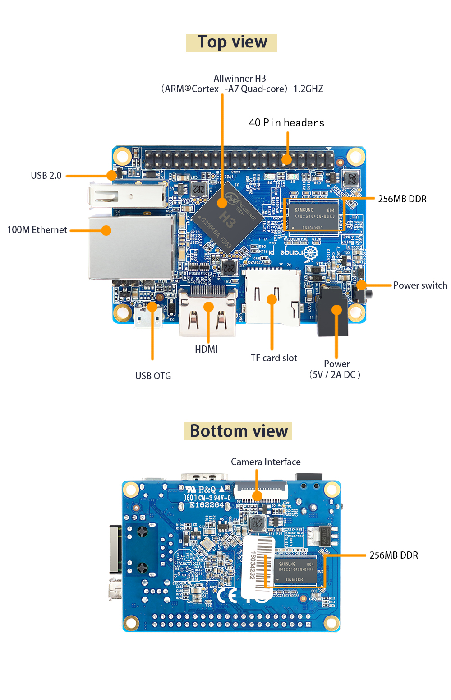
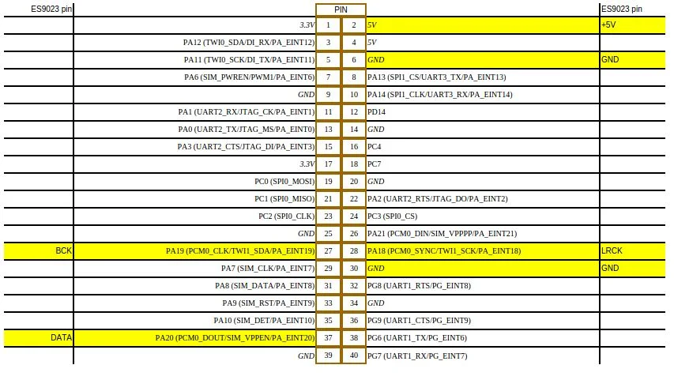

# Board

# 40 Pin GPIO Headers

The Orange Pi One & Lite both have a Raspberry Pi model B+ compatible 40-pin, 0.1" connector with several low-speed interfaces. **Warning: The header's orientation on these 2 boards is 180°, please look for the little triangle printed on the board pointing to physical pin 1 (especially if you plan to insert power through GPIO header)**

| Function  | Pin  | Pin  | Function |
|---|---|---|---|
| 3.3V | 1 | 2 | 5V |
| PA12 (TWI0_SDA/DI_RX/PA_EINT12) | 3 | 4 | 5V |
| PA11 (TWI0_SCK/DI_TX/PA_EINT11) | 5 | 6 | GND |
| PA6 (SIM_PWREN/PWM1/PA_EINT6) | 7 | 8 | PA13 (SPI1_CS/UART3_TX/PA_EINT13) |
| GND | 9 | 10 | PA14 (SPI1_CLK/UART3_RX/PA_EINT14) |
| PA1 (UART2_RX/JTAG_CK/PA_EINT1) | 11 | 12 | PD14 |
| PA0 (UART2_TX/JTAG_MS/PA_EINT0) | 13 | 14 | GND |
| PA3 (UART2_CTS/JTAG_DI/PA_EINT3) | 15 | 16 | PC4 |
| 3.3V | 17 | 18 | PC7 |
| PC0 (SPI0_MOSI) | 19 | 20 | GND |
| PC1 (SPI0_MISO) | 21 | 22 | PA2 (UART2_RTS/JTAG_DO/PA_EINT2) |
| PC2 (SPI0_CLK) | 23 | 24 | PC3 (SPI0_CS) |
| GND | 25 | 26 | PA21 (PCM0_DIN/SIM_VPPPP/PA_EINT21) |
| PA19 (PCM0_CLK/TWI1_SDA/PA_EINT19) | 27 | 28 | PA18 (PCM0_SYNC/TWI1_SCK/PA_EINT18) |
| PA7 (SIM_CLK/PA_EINT7) | 29 | 30 | GND |
| PA8 (SIM_DATA/PA_EINT8) | 31 | 32 | PG8 (UART1_RTS/PG_EINT8) |
| PA9 (SIM_RST/PA_EINT9) | 33 | 34 | GND |
| PA10 (SIM_DET/PA_EINT10) | 35 | 36 | PG9 (UART1_CTS/PG_EINT9) |
| PA20 (PCM0_DOUT/SIM_VPPEN/PA_EINT20) | 37 | 38 | PG6 (UART1_TX/PG_EINT6) |
| GND | 39 | 40 | PG7 (UART1_RX/PG_EINT7) |

[http://www.linux-sunxi.org/Orange_Pi_One](http://www.linux-sunxi.org/Orange_Pi_One)
